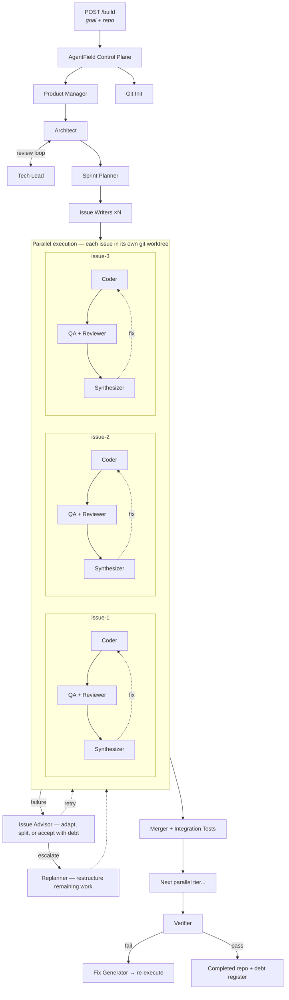
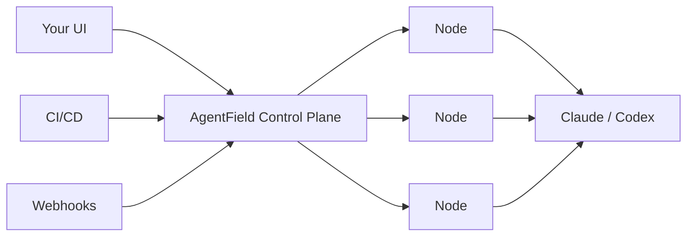

# AF-SWE

Production-grade software engineering, not vibe coding. One API call decomposes your goal into a dependency-ordered plan and deploys hundreds of autonomous coding agents — each with full tool use — that architect, code, test, review, and verify in parallel. The output is tested, reviewed, integration-verified code with a debt register for anything that was compromised.

```bash
curl -X POST http://localhost:8080/api/v1/execute/async/swe-planner.build \
  -H "Content-Type: application/json" \
  -d '{"goal": "Add JWT auth to all API endpoints", "repo_path": "/path/to/repo"}'
```

## The problem

AI coding agents can write code. But production software requires architecture review, dependency-ordered execution, test coverage, code review, integration testing, and verification against acceptance criteria — across dozens or hundreds of issues that must compose correctly. That's not a single-session problem. AF-SWE turns coding agents into a coordinated engineering org that delivers the whole thing autonomously.



> Each box in the diagram is an independent agent instance — a full coding agent with tool use, file system access, and git operations. A typical build deploys 400–500+ agent instances across parallel worktrees. Tested up to 10,000.

## What you get

- Architecture designed and reviewed before any code is written
- Issues decomposed with dependency ordering and parallel execution
- Every issue coded, tested, and reviewed independently in isolated worktrees
- Integration tested after each merge tier
- Verified against the original acceptance criteria
- Debt register for anything that was relaxed, skipped, or compromised

## Why the output is production quality

Three nested self-correction loops ensure the bar is met, not just attempted:

**Inner** — Coder → QA → Reviewer → Synthesizer. Tests fail? Feed the errors back to the coder. Loops up to 5 times.

**Middle** — Issue Advisor. Coding loop exhausted? Inspect the worktree, read every attempt, and decide: change approach, relax requirements (recorded as debt), split into sub-issues, accept with tracked gaps, or escalate.

**Outer** — Replanner. Issue truly stuck? Rewrite remaining issues, reduce scope, or route around the failure. The execution plan reshapes itself at runtime.

Every compromise is recorded. The final output includes a **debt register** — what was relaxed, what was skipped, and why.

## Runs anywhere

Stateless nodes register with the [AgentField](https://agentfield.ai) control plane and wait for work. Run on a laptop, a container, or a Lambda. Scale by adding nodes. All state is checkpointed — crash, restart, call `resume_build`, pick up where you left off.



## Quick start

```bash
pip install -r requirements.txt
af                 # control plane on :8080
python main.py     # registers "swe-planner" node
```

## API

Async endpoints via the control plane. Returns `execution_id` immediately.

### Core

```bash
# Full pipeline: plan → execute → verify
curl -X POST http://localhost:8080/api/v1/execute/async/swe-planner.build \
  -d '{"goal": "...", "repo_path": "...", "config": {}}'

# Plan only
curl -X POST http://localhost:8080/api/v1/execute/async/swe-planner.plan \
  -d '{"goal": "...", "repo_path": "..."}'

# Execute a pre-made plan
curl -X POST http://localhost:8080/api/v1/execute/async/swe-planner.execute \
  -d '{"plan_result": { ... }, "repo_path": "..."}'

# Resume after crash
curl -X POST http://localhost:8080/api/v1/execute/async/swe-planner.resume_build \
  -d '{"repo_path": "...", "artifacts_dir": ".artifacts"}'
```

All with `-H "Content-Type: application/json"`.

### Every agent is an endpoint

Use individual agents as building blocks in your own systems.

`POST /api/v1/execute/async/swe-planner.<agent>`

| Agent | In → Out |
|-------|----------|
| `run_product_manager` | goal → PRD |
| `run_architect` | PRD → architecture |
| `run_tech_lead` | architecture → review |
| `run_sprint_planner` | architecture → parallelized issues |
| `run_issue_writer` | issue spec → detailed issue file |
| `run_coder` | issue + worktree → code + tests + commit |
| `run_qa` | worktree → test results |
| `run_code_reviewer` | worktree → quality/security review |
| `run_qa_synthesizer` | QA + review → FIX / APPROVE / BLOCK |
| `run_issue_advisor` | failure context → adapt / split / accept / escalate |
| `run_replanner` | DAG state + failures → restructured plan |
| `run_merger` | branches → merged with conflict resolution |
| `run_integration_tester` | merged repo → integration test results |
| `run_verifier` | repo + PRD → acceptance pass/fail |
| `generate_fix_issues` | failed criteria → targeted fix issues |

### Monitoring

```bash
curl http://localhost:8080/api/v1/execute/status/<execution_id>
curl http://localhost:8080/api/v1/execute/notes/<execution_id>   # live progress
```

## Config

Pass `config` to `build` or `execute`. All optional.

| Key | Default | |
|-----|---------|---|
| `max_coding_iterations` | `5` | Inner loop budget per issue |
| `max_advisor_invocations` | `2` | Middle loop budget per issue |
| `max_replans` | `2` | Outer loop budget per build |
| `enable_issue_advisor` | `true` | Enable middle loop |
| `enable_replanning` | `true` | Enable outer loop |
| `agent_timeout_seconds` | `2700` | Per-agent timeout |
| `ai_provider` | `"claude"` | `"claude"` or `"codex"` |
| `coder_model` | `"sonnet"` | Model for coding |
| `agent_max_turns` | `150` | Tool-use turns per agent |

Full schema: [`execution/schemas.py`](execution/schemas.py)

## Artifacts

```
.artifacts/
├── plan/           # PRD, architecture, issue specs
├── execution/      # checkpoint, per-issue iterations, agent logs
└── verification/   # acceptance criteria results
```

## Requirements

- Python 3.11+
- [AgentField](https://agentfield.ai) control plane
- Anthropic or OpenAI API key

Internals: [ARCHITECTURE.md](ARCHITECTURE.md)
