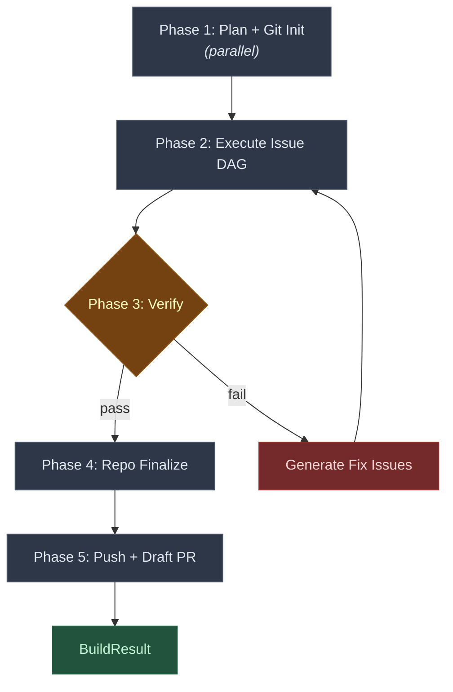

# SWE-AF Architecture

SWE-AF is an [AgentField](https://github.com/Agent-Field/agentfield) node that transforms a natural-language goal into a verified, merged codebase with a draft GitHub PR. It registers as `swe-planner` on the AgentField control plane and exposes reasoner endpoints callable via async execution APIs. A typical build orchestrates 400–500+ agent invocations across 22 specialized roles; large builds scale into the thousands. Every agent action is cryptographically attested via AgentField's [DID/VC governance chain](#agentfield-governance-did--verifiable-credentials).

```mermaid
flowchart LR
    Goal["🎯 Natural-Language Goal"]
    SWE["SWE-AF Node<br/><i>swe-planner</i>"]
    PR["📦 Verified PR"]
    AF["AgentField Control Plane"]

    Goal --> AF -->SWE --> PR
    AF -. "DID/VC governance<br/>async execution" .-> SWE
```



**Table of Contents**

- [Build Pipeline](#build-pipeline)
- [Planning → Issue DAG](#planning--issue-dag)
- [Execution Engine & Architectural Patterns](#execution-engine--architectural-patterns)
- [AgentField Governance: DID & Verifiable Credentials](#agentfield-governance-did--verifiable-credentials)
- [Agent Catalog](#agent-catalog)

---

## Build Pipeline

The top-level `build()` reasoner is the single entry point. It drives six phases in sequence, with an embedded verify-fix loop that makes the pipeline self-correcting. The entire pipeline is idempotent — checkpoints after every phase boundary allow `resume_build()` to restart from the exact failure point.



**Phase 1 — Plan + Git Init.** Two concurrent operations via `asyncio.gather`: the planning chain produces a PRD, architecture, and Issue DAG (see [next section](#planning--issue-dag)), while `run_git_init` sets up the integration branch and records the initial commit SHA. Git init is non-fatal — its failure doesn't block the build.

**Phase 2 — Execute Issue DAG.** The DAG executor runs all issues through the [hierarchical escalation loops](#pattern-hierarchical-escalation-control), parallelizing within dependency levels. This is where the bulk of agent invocations happen. Returns a `DAGState` with per-issue outcomes, accumulated debt, and merge history.

**Phase 3 — Verify-Fix Loop.** The Verifier agent checks every acceptance criterion from the PRD against the actual codebase. If any criterion fails, the Fix Generator produces targeted fix issues, which feed back into the executor. This loop runs up to `max_verify_fix_cycles + 1` times. On pass, the build advances.

**Phase 4 — Repo Finalize.** Cleanup: remove build artifacts from the repo, update `.gitignore`, ensure the working tree is presentable. Non-blocking — failure here doesn't affect the build result.

**Phase 5 — Push + Draft PR.** Pushes the integration branch and creates a draft PR via `gh`. The PR body includes the PRD, architecture summary, and any accumulated technical debt — reviewers see exactly what was built, what was deferred, and why.

**Result.** `BuildResult` captures: plan output, full `DAGState`, verification result, success flag, summary, and PR URL.

---

## Planning → Issue DAG

The planning chain is a five-agent pipeline that progressively refines a vague goal into a dependency-sorted graph of concrete work items. The key insight is that what emerges is an **Issue DAG** — a dependency graph of *work items*, not agents. Agents are execution machinery; the DAG is the plan.

**The Chain:**

1. **Product Manager** — reads the repo, interprets the goal, produces a PRD with validated requirements, acceptance criteria, must-haves, nice-to-haves, and out-of-scope items.

2. **Architect** — reads the PRD and codebase, produces a system design: components, interfaces, architectural decisions with rationale, and a file-changes overview.

3. **Tech Lead** — reviews the architecture against the PRD in a bounded loop (up to `max_review_iterations + 1` rounds). If not approved, the Architect revises. If the loop exhausts, the last revision is auto-approved — the system never blocks on infinite review cycles.

4. **Sprint Planner** — decomposes the approved architecture into `PlannedIssue` items. Each issue has a name, acceptance criteria mapped from the PRD, dependency edges (`depends_on`), file manifests (`files_to_create`, `files_to_modify`), and — critically — an `IssueGuidance` block:

   ```
   IssueGuidance:
     needs_new_tests: bool       # should the coder write tests?
     estimated_scope: str        # "trivial" | "small" | "medium" | "large"
     touches_interfaces: bool    # cross-boundary work?
     needs_deeper_qa: bool       # route to flagged (4-call) path?
     testing_guidance: str       # proportional test instructions
     review_focus: str           # what the reviewer should focus on
     risk_rationale: str         # why this needs (or doesn't need) deep QA
   ```

   The `needs_deeper_qa` flag is the routing decision that splits execution into [two paths](#pattern-risk-proportional-resource-allocation) — it's the sprint planner's judgment call on risk.

5. **Issue Writers** — fan out in parallel across all issues, writing self-contained `issue-*.md` specs with full context so each coder agent can work independently.

**From Issues to Levels:**

After planning, `_compute_levels()` runs **Kahn's algorithm** to topologically sort issues into parallel execution levels. Issues with no unmet dependencies land in level 0; issues depending only on level-0 work land in level 1; and so on. The algorithm detects cycles and raises immediately — a cyclic plan is a hard failure.

`_validate_file_conflicts()` then scans each level for issues that touch the same files. These aren't blocking — parallel issues can still run — but the conflicts are passed to the Merger agent so it can make informed resolution decisions when branches converge.

The output is a `PlanResult`: PRD, architecture, review, sorted issues with sequence numbers, execution levels, file conflicts, and a rationale for the decomposition.

---

## Execution Engine & Architectural Patterns

This is the heart of SWE-AF. The execution engine isn't a simple "run each issue" loop — it's a layered system of control loops, adaptive strategies, and resilience patterns that handle the reality of autonomous code generation: things fail, tests break, approaches don't work, and the plan itself may need to change.

The patterns below are not SWE-AF inventions — they are foundational architectural patterns for any production [AI backend](https://www.agentfield.ai/blog/posts/ai-backend) that aims for **guided autonomy** rather than the "autonomous agent fantasy" of unrestricted single-orchestrator systems. Each pattern addresses a fundamental challenge in multi-agent autonomous systems. SWE-AF's contribution is a concrete, battle-tested implementation of all eight working in concert.

### Pattern: Hierarchical Escalation Control

**The general principle.** Any autonomous system that goes beyond single-shot inference needs a theory of failure recovery. The question isn't *if* an agent will fail — it's *what happens next*. Without structured escalation, systems either retry forever (wasting budget) or abort immediately (wasting progress). The pattern is concentric control loops with increasing blast radius and decreasing frequency, mirroring how human organizations escalate: a developer retries locally, a tech lead changes the approach, a PM rescopes the project.

**Why this is critical.** In agentic systems, the alternative is flat retry logic — the same agent retries the same task with no change in strategy, context, or scope. This is the most common failure mode in production agent deployments: an agent gets stuck in a loop with no mechanism to escalate to a broader intervention. Hierarchical escalation gives the system *multiple levels of recovery* before admitting defeat.

**How SWE-AF implements it.** The execution engine operates as three nested control loops:

```mermaid
flowchart TD
    subgraph outer["Outer Loop — Replanner (per-build)"]
        direction TB
        R{"Replanner<br/><i>4 actions</i>"}

        subgraph middle["Middle Loop — Issue Advisor (per-issue)"]
            direction TB
            A{"Issue Advisor<br/><i>5 actions</i>"}

            subgraph inner_default["Inner Loop — Default Path (2 calls)"]
                direction LR
                C1["Coder"] --> RV1["Reviewer"]
                RV1 -- "fix" --> C1
            end

            subgraph inner_flagged["Inner Loop — Flagged Path (4 calls)"]
                direction LR
                C2["Coder"] --> QA["QA"] & RV2["Reviewer"]
                QA & RV2 --> SYN["Synthesizer"]
                SYN -- "fix" --> C2
            end

            A -- "retry_modified / retry_approach" --> inner_default
            A -- "retry_modified / retry_approach" --> inner_flagged
            A -- "split" --> SPLIT["Sub-issues"]
            A -- "accept_with_debt" --> DEBT["Record Debt"]
            A -- "escalate_to_replan" --> R
        end

        R -- "continue" --> SKIP["Skip downstream"]
        R -- "modify_dag" --> REBUILD["Rebuild DAG"]
        R -- "reduce_scope" --> DROP["Drop non-essential"]
        R -- "abort" --> HALT["Stop pipeline"]
    end
```



**Inner Loop** runs up to `max_coding_iterations` (default: 5) per issue. On the default path, the coder writes code and runs tests, then the reviewer approves, requests fixes, or blocks. On the flagged path, QA and the reviewer run **in parallel** after the coder, and a synthesizer merges their feedback into a single fix/approve/block decision. The synthesizer also detects stuck loops — if the coder is cycling without progress, it breaks the loop early.

**Middle Loop** — the Issue Advisor — activates when the inner loop exhausts without approval. It has five actions, each a different recovery strategy:

| Action | What happens |
|---|---|
| `RETRY_MODIFIED` | Relax acceptance criteria, retry the coding loop. Dropped criteria become [technical debt](#pattern-graceful-degradation-with-explicit-incompleteness). |
| `RETRY_APPROACH` | Keep the same ACs but inject a different strategy (e.g., "use a different library", "simplify the data model"). |
| `SPLIT` | Break the issue into smaller sub-issues. Handled by the split gate at the level barrier. |
| `ACCEPT_WITH_DEBT` | The work is close enough. Record each gap as a typed, severity-rated debt item and mark the issue complete. |
| `ESCALATE_TO_REPLAN` | This issue can't be fixed locally — flag it for the outer loop. |

The advisor runs up to `max_advisor_invocations` (default: 2) per issue. On the final invocation, the prompt explicitly warns that this is the last chance — biasing toward `ACCEPT_WITH_DEBT` or `ESCALATE_TO_REPLAN` rather than another retry.

**Outer Loop** — the Replanner — fires when one or more issues in a level produce `FAILED_UNRECOVERABLE` or `FAILED_ESCALATED` outcomes. It sees the full `DAGState` (completed issues, failures, debt, replan history) and chooses from four actions:

| Action | What happens |
|---|---|
| `CONTINUE` | Proceed as-is. Skip downstream dependents of failed issues. Enrich them with failure notes so future work is aware. |
| `MODIFY_DAG` | Restructure the remaining Issue DAG — add new issues, remove others, modify dependencies. [Rebuilds levels from scratch.](#pattern-runtime-plan-mutation) |
| `REDUCE_SCOPE` | Skip non-essential issues to unblock the build. |
| `ABORT` | Cannot recover. Stop the pipeline. |

**Crash fallback**: if the replanner agent itself fails (LLM timeout, malformed output), the system defaults to `CONTINUE`, not `ABORT`. The build should degrade gracefully, not halt on orchestration errors.

---

### Pattern: Structured Concurrency with Barrier Synchronization

**The general principle.** Multi-agent systems need parallelism — sequential execution of independent work wastes time and money. But naive parallelism (fire-and-forget) creates chaos: agents interfere with each other, partial failures cascade, and there's no clean state to recover from. The answer is *structured concurrency* — parallel execution within well-defined boundaries, with barrier synchronization points that enforce invariants before the next phase begins.

**Why this is critical.** The [AI backend](https://www.agentfield.ai/blog/posts/ai-backend) framing warns against the "DAG trap" — treating agent systems as rigid sequential pipelines. But the opposite extreme — fully unstructured parallelism — is equally dangerous. Structured concurrency is the middle path: agents run in parallel where dependencies allow, but synchronization barriers guarantee that each wave produces a consistent, validated state. This is what separates a production system from a demo.

**How SWE-AF implements it.** Issues within a dependency level execute concurrently via `asyncio.gather`. A level of 5 issues can spawn 10–20 agent invocations in parallel (each issue runs its own inner loop). Between levels, a structured gate sequence runs:

1. **Worktree setup** — create isolated git worktrees for the next level's issues.
2. **Parallel execution** — all issues in the level run concurrently through the inner/middle loops.
3. **Result classification** — sort outcomes into completed, completed-with-debt, failed-needs-split, failed-escalated, and failed-unrecoverable.
4. **Merge gate** — the Merger agent integrates completed branches into the integration branch, resolving conflicts with AI assistance.
5. **Integration test gate** — if the merger flags cross-boundary changes, the Integration Tester validates.
6. **Debt gate** — process `COMPLETED_WITH_DEBT` results: record debt, propagate `debt_notes` to downstream issues.
7. **Split gate** — process `FAILED_NEEDS_SPLIT` results: generate sub-issues, inject them into remaining levels.
8. **Replan gate** — if unrecoverable/escalated failures exist, invoke the replanner.
9. **Checkpoint** — save full `DAGState` to disk.
10. **Advance** — move to the next level (or reset to level 0 if the replanner restructured the DAG).

This gate sequence ensures that every level produces a clean, tested, checkpointed state before the next level begins. No level starts on a dirty foundation.

---

### Pattern: Agent Isolation with Semantic Reconciliation

**The general principle.** When multiple agents operate on the same shared state (a filesystem, a database, a document), they interfere with each other. Write conflicts, stale reads, and race conditions are inevitable. The pattern is twofold: *isolate* agents so they can't interfere during execution, then *reconcile* their outputs using semantic understanding rather than mechanical merging.

**Why this is critical.** Most multi-agent frameworks either serialize execution (safe but slow) or share mutable state (fast but brittle). The isolation-reconciliation pattern enables true parallel execution without sacrificing correctness. The key insight is that reconciliation must be *semantic* — understanding the intent behind each agent's changes — not just syntactic diff resolution. A mechanical merge that resolves line conflicts can still produce logically broken code.

**How SWE-AF implements it.** Each parallel issue gets its own **git worktree** — a separate working directory on a dedicated branch (`issue/{NN}-{slug}`). Coders have full filesystem access without interfering with each other. No lock contention, no merge conflicts during coding.

After level completion, the **Merger agent** integrates completed branches into the integration branch. This isn't a mechanical `git merge` — the Merger reads the PRD, architecture context, and file conflict annotations from the planning phase to make intelligent resolution decisions. When two issues modify the same file, the Merger understands *what each change intended* and produces a merged result that preserves both intents.

The merge result includes: which branches succeeded, which failed, conflict resolution strategies used, and whether integration testing is needed. If the merge fails, it retries once before marking branches as unmerged. After merge, worktrees are cleaned up — branches optionally deleted, working directories removed.

---

### Pattern: Graceful Degradation with Explicit Incompleteness

**The general principle.** Autonomous systems that target 100% completion are fragile — a single unresolvable failure blocks the entire pipeline. Production systems need *graceful degradation*: the ability to deliver partial results while being explicit about what's missing and why. The pattern is to make incompleteness a first-class data type, not a silent omission. Gaps are tracked, typed, severity-rated, and propagated to every downstream consumer.

**Why this is critical.** In any sufficiently complex agentic workflow, some subtasks will fail. The question is whether the system treats this as a catastrophe (halt everything) or as information (record the gap, adjust downstream, continue). Systems that silently drop failed work produce outputs that *look* complete but aren't — a far worse outcome than an explicit "we didn't finish X because Y." This pattern is what enables an [AI backend](https://www.agentfield.ai/blog/posts/ai-backend) to operate with the same pragmatism as a human team: ship what works, document what doesn't, keep moving.

**How SWE-AF implements it.** When the Issue Advisor relaxes acceptance criteria via `RETRY_MODIFIED`, or accepts incomplete work via `ACCEPT_WITH_DEBT`, the gaps don't vanish — they become **typed, severity-rated debt items** tracked in `DAGState.accumulated_debt`:

```
{
  "type": "dropped_acceptance_criterion" | "missing_functionality" | "unmet_acceptance_criterion",
  "criterion": "...",
  "issue_name": "auth-middleware",
  "severity": "high" | "medium" | "low",
  "justification": "..."
}
```

Debt propagates downstream. When an issue completes with debt, all issues that depend on it receive `debt_notes` — structured annotations explaining what upstream *didn't* deliver. Coders for downstream issues see these notes at the start of every iteration, so they can work around gaps rather than building on assumptions that don't hold.

Similarly, when issues fail outright, `_enrich_downstream_with_failure_notes()` propagates `failure_notes` to dependent issues, explaining what was expected vs. what was delivered.

Debt accumulates across the entire build and surfaces in the final PR body. Nothing is silently dropped — the PR reviewer sees a complete accounting of every scope reduction, every relaxed criterion, and every gap.

---

### Pattern: Runtime Plan Mutation

**The general principle.** Static plans break on contact with reality. In any autonomous system operating over extended timeframes (minutes to hours), the initial plan will become partially invalid as execution reveals unforeseen constraints, failures, or opportunities. The pattern is to treat the execution plan as a *mutable runtime artifact* — not a static script — that the system can restructure while preserving invariants (no cycles, no orphaned dependencies, no lost state).

**Why this is critical.** This is the deepest divergence from the "DAG trap" described in the [AI backend](https://www.agentfield.ai/blog/posts/ai-backend) framing. A rigid DAG is a plan that can't adapt. Runtime plan mutation means the system can add tasks, remove tasks, change dependencies, and restructure the execution graph *while the execution is in progress* — without restarting from scratch and without losing the work already completed. This is what makes an autonomous system truly autonomous rather than merely automated.

**How SWE-AF implements it.** When the replanner fires with `MODIFY_DAG`, it doesn't just skip failed issues — it can **restructure the entire remaining Issue DAG**. `apply_replan()` in `dag_utils.py` executes this in five steps:

1. **Filter** — separate completed/failed issues from the remaining working set.
2. **Remove** — delete issues the replanner marked for removal.
3. **Skip** — mark issues as skipped (preserved in state but not executed).
4. **Update** — merge modifications into existing issues (changed ACs, new dependencies, different approach).
5. **Add** — inject entirely new issues with auto-assigned sequence numbers.

After mutations, `recompute_levels()` runs Kahn's algorithm on the remaining issues, treating completed issues as already-satisfied dependencies. The DAG state resets to `current_level = 0` and execution restarts from the beginning of the new level structure.

Previous replan decisions are stored in `DAGState.replan_history` and fed back to the replanner on subsequent invocations. This prevents the system from repeating failed strategies — each replan attempt has full context of what was already tried and why it didn't work.

---

### Pattern: Durable Execution & Checkpoint Recovery

**The general principle.** Long-running autonomous processes — builds, research pipelines, multi-step workflows — will be interrupted. Hardware fails, LLM providers have outages, rate limits hit, timeouts fire. Any system that can't survive interruption is a system you can't rely on. The pattern is *durable execution*: serialize the complete execution state at every significant boundary so the system can resume from the exact failure point, not from scratch.

**Why this is critical.** An agentic build that takes 30 minutes and fails at minute 25 must not restart from minute 0. This is not just an efficiency concern — it's a reliability requirement. Without checkpointing, long-running agent workflows become increasingly fragile as they grow longer, because the probability of *some* interruption approaches 1. Durable execution inverts this: longer workflows are more resilient because they have more recovery points.

**How SWE-AF implements it.** Full `DAGState` is serialized to `.artifacts/execution/checkpoint.json` at every significant boundary:

- After initial DAG setup
- Before and after each level execution
- After split gate (sub-issues injected)
- After replan applied (DAG restructured)
- On build completion

`DAGState` captures everything needed to resume: repo paths, artifact paths, plan summaries, all issues with current state, execution levels, completed/failed/skipped/in-flight issue lists, current level index, replan count and history, git branch tracking (integration branch, original branch, initial commit, worktree directory), merge results, integration test results, accumulated debt, and adaptation history.

`resume_build()` loads the checkpoint, reconstructs the plan result from saved state, and calls `execute()` with `resume=True`. The executor loads the checkpoint and skips already-completed levels, continuing from the exact failure point. This enables reliability across crashes, timeouts, and interruptions — a build that fails at level 3 of 5 doesn't restart from scratch.

---

### Pattern: Risk-Proportional Resource Allocation

**The general principle.** Not all tasks in an autonomous workflow carry the same risk or complexity. Applying uniform scrutiny everywhere is wasteful — heavyweight quality assurance on trivial tasks burns budget, while lightweight checks on critical tasks miss defects. The pattern is to classify tasks by risk at planning time and allocate quality assurance resources proportionally: lean paths for safe work, thorough paths for risky work.

**Why this is critical.** This is how human engineering teams already work — a one-line config change gets a quick review, while a security-critical refactor gets a formal design review, dedicated QA, and multiple sign-offs. Autonomous systems that lack this judgment either over-spend (every task gets maximum scrutiny, driving costs up) or under-spend (every task gets minimum scrutiny, driving quality down). The sprint planner's risk assessment is a form of the [guided autonomy](https://www.agentfield.ai/blog/posts/ai-backend) principle: autonomous judgment within a framework of expectations.

**How SWE-AF implements it.** The Sprint Planner's `IssueGuidance.needs_deeper_qa` flag routes each issue to one of two execution paths:

**Default path (2 LLM calls):** Coder → Reviewer. For straightforward issues — well-scoped, low risk, familiar patterns. The reviewer approves, requests fixes, or blocks (reserved for security/crash/data-loss concerns).

**Flagged path (4 LLM calls):** Coder → QA + Reviewer (parallel) → Synthesizer. For complex or risky issues — touching interfaces, large scope, unfamiliar territory. QA writes and runs tests independently. The reviewer evaluates code quality. The synthesizer merges both signals into a single decision, detecting contradictions and stuck loops.

The Sprint Planner's `risk_rationale` field documents *why* each routing decision was made — every allocation choice is auditable.

---

### Pattern: Cross-Agent Knowledge Propagation

**The general principle.** In multi-agent systems, each agent starts with a blank context — no knowledge of what sibling or predecessor agents discovered. This means every agent repeats the same mistakes, re-discovers the same conventions, and ignores the same pitfalls. The pattern is *cross-agent knowledge propagation*: a shared memory layer where agents write structured discoveries and downstream agents read them, so lessons learned early propagate through the entire workflow.

**Why this is critical.** Without shared memory, a 20-agent pipeline is 20 independent agents that happen to run in sequence. *With* shared memory, it's a learning system where agent 15 benefits from everything agents 1–14 discovered. This is especially important in autonomous systems where agents encounter codebase-specific conventions, failure modes, and interface contracts that aren't in any documentation. The first agent to discover "this project uses camelCase" shouldn't be the only one that knows.

**How SWE-AF implements it.** When `enable_learning=true`, SWE-AF maintains a shared memory store across all issues in a build:

| Memory Key | Written When | Read By | Content |
|---|---|---|---|
| `codebase_conventions` | First successful coder | All subsequent coders | Discovered conventions (naming, patterns, structure) |
| `failure_patterns` | After any failure | All subsequent coders | Last 10 failure patterns with issue context |
| `bug_patterns` | After any failure | All subsequent coders | Last 20 common bug types with frequency and affected modules |
| `interfaces/{issue_name}` | On issue completion | Dependent issues | Exported interfaces, created files, test status |
| `build_health` | Continuously | Orchestration agents | Aggregate status: passing/failing modules, test counts, debt items |

The memory is injected into every coding iteration as additional context. Conventions discovered in issue 1 propagate to issues 5, 10, 15. A failure pattern encountered in level 1 warns coders in level 3 to avoid the same trap. Interface exports from completed issues give downstream coders concrete import paths rather than guesses.

This is not a vector database or retrieval system — it's a simple key-value store with structured schemas, updated synchronously at known lifecycle points. The simplicity is intentional: memory is only useful if it's reliable, and the schemas ensure that what's written is always parseable by what reads it.

---

## AgentField Governance: DID & Verifiable Credentials

SWE-AF doesn't operate in a vacuum — it runs as a node in the [AgentField](https://github.com/Agent-Field/agentfield) control plane, which provides three layers of cryptographic governance over every agent action.

### DID Identity

Every agent node, reasoner, and skill in the AgentField network receives a **Decentralized Identifier (DID)** via hierarchical BIP-44 key derivation. When SWE-AF starts, it registers with the control plane:

```python
app = Agent(
    node_id="swe-planner",
    version="1.0.0",
    agentfield_server=os.getenv("AGENTFIELD_SERVER", "http://localhost:8080"),
)
```

The control plane assigns a DID, derives signing keys, and makes the node resolvable via the DID resolution API. Every reasoner decorated with `@app.reasoner()` becomes a callable endpoint addressable by its DID.

### Execution Verifiable Credentials

Every reasoner-to-reasoner call generates a cryptographically signed **Verifiable Credential (VC)** capturing:

- Caller and target DIDs
- Input/output content hashes
- Timestamp and execution metadata
- Cryptographic signature from the caller's derived key

This means every agent invocation — every coder run, every review, every advisor decision — has a tamper-evident provenance record. You can verify that a specific output was produced by a specific agent with specific inputs.

```mermaid
sequenceDiagram
    participant CP as AgentField Control Plane
    participant SWE as SWE-AF (swe-planner)
    participant R as Target Reasoner

    SWE->>CP: Register node (DID assignment)
    CP-->>SWE: DID + signing keys

    SWE->>R: app.call("target.reasoner", args)
    Note over SWE: Sign VC with caller DID,<br/>input hash, target DID
    R-->>SWE: Result
    Note over SWE: Append output hash to VC,<br/>store in workflow chain

    SWE->>CP: Submit workflow VC chain
    CP-->>SWE: Chain verified ✓
```



### Workflow VC Chain

All execution VCs for a single build are aggregated into a **workflow chain** — an ordered, linked sequence of credentials that captures the complete provenance of the build. For any output in the final PR, you can trace back through the chain to find: which agent produced it, what inputs it received, which agent produced *those* inputs, and so on, all the way back to the original goal.

This is what separates autonomous agent infrastructure from "just calling an LLM in a loop." The [AgentField platform](https://github.com/Agent-Field/agentfield) provides the governance layer that makes agent outputs auditable, attributable, and verifiable — a requirement for any production deployment where you need to explain *how* a result was produced.

---

## Agent Catalog

SWE-AF orchestrates 22 specialized agents across four phases. Each agent is a reasoner endpoint with typed input/output schemas and a defined tool set.

### Planning Agents

| Agent | Role | Tools | Output Schema |
|---|---|---|---|
| **Product Manager** | Interprets goal, produces PRD | `READ` `GLOB` `GREP` `BASH` | `PRD` |
| **Architect** | Designs system from PRD | `READ` `WRITE` `GLOB` `GREP` `BASH` | `Architecture` |
| **Tech Lead** | Reviews architecture against PRD | `READ` `GLOB` `GREP` | `ReviewResult` |
| **Sprint Planner** | Decomposes into Issue DAG with guidance | `READ` `GLOB` `GREP` | `SprintPlanOutput` |
| **Issue Writer** | Writes self-contained issue specs (parallel) | `READ` `WRITE` `GLOB` `GREP` | `IssueWriterOutput` |

### Execution Agents

| Agent | Loop | Tools | Output Schema |
|---|---|---|---|
| **Coder** | Inner | `READ` `WRITE` `EDIT` `BASH` `GLOB` `GREP` | `CoderResult` |
| **QA** | Inner (flagged) | `READ` `WRITE` `EDIT` `BASH` `GLOB` `GREP` | `QAResult` |
| **Code Reviewer** | Inner | `READ` `GLOB` `GREP` `BASH` | `CodeReviewResult` |
| **QA Synthesizer** | Inner (flagged) | *(none — LLM-only)* | `QASynthesisResult` |
| **Retry Advisor** | Pre-advisor | `READ` `GLOB` `GREP` `BASH` | `RetryAdvice` |
| **Issue Advisor** | Middle | `READ` `GLOB` `GREP` `BASH` | `IssueAdvisorDecision` |
| **Replanner** | Outer | `READ` `GLOB` `GREP` `BASH` | `ReplanDecision` |

### Git & Merge Agents

| Agent | Trigger | Tools | Output Schema |
|---|---|---|---|
| **Git Init** | Build start | `BASH` | `GitInitResult` |
| **Workspace Setup** | Level gate | `BASH` | `WorkspaceSetupResult` |
| **Merger** | Level gate (post-execution) | `BASH` `READ` `GLOB` `GREP` | `MergeResult` |
| **Integration Tester** | Level gate (post-merge) | `BASH` `READ` `WRITE` `GLOB` `GREP` | `IntegrationTestResult` |
| **Workspace Cleanup** | Level gate (post-merge) | `BASH` | `WorkspaceCleanupResult` |

### Verification & Finalization Agents

| Agent | Phase | Tools | Output Schema |
|---|---|---|---|
| **Verifier** | Post-execution | `READ` `GLOB` `GREP` `BASH` | `VerificationResult` |
| **Fix Generator** | Verify-fix loop | `READ` `GLOB` `GREP` `BASH` | `FixGeneratorOutput` |
| **Repo Finalizer** | Pre-PR | `BASH` `READ` `GLOB` `GREP` | `RepoFinalizeResult` |
| **GitHub PR Creator** | Final | `BASH` | `GitHubPRResult` |

### Model Configuration

Every build now uses a single V2 model contract:

- `runtime`: `claude_code` or `open_code`
- `models`: flat role map (`default` + explicit role keys)

Supported role keys:

- Planning: `pm`, `architect`, `tech_lead`, `sprint_planner`
- Coding: `coder`, `qa`, `code_reviewer`, `qa_synthesizer`
- Orchestration: `replan`, `retry_advisor`, `issue_writer`, `issue_advisor`
- Verification/Git: `verifier`, `git`, `merger`, `integration_tester`

Resolution order:

`runtime defaults` → `models.default` → `models.<role>`

Runtime defaults:

| Runtime | Base default | Special default |
|---|---|---|
| `claude_code` | `sonnet` | `qa_synthesizer=haiku` |
| `open_code` | `minimax/minimax-m2.5` | none |
